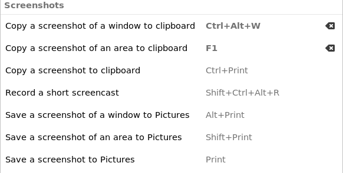

# OCR on Gnome

> Windows上最方便的截图+OCR是 Snipaste(Windows Store免费下载)+TIM/QQ OCR
>
> 摆脱QQ OCR有点麻烦 就没有折腾了

本文介绍 Ubuntu Gnome下的截图+OCR解决方案

> 依赖 : gnome-screenshot(应该是自带的) tesseract-ocr imagemagick(放大图片提高精度) xclip(将内容复制到剪切板)

## screenshot


从快捷键设置能看出来 screenshot 是否自带

同时改一下快捷键更方便单手截图操作



## 下载依赖

```bash
#!/bin/bash
## install tesseract-ocr
sudo add-apt-repository ppa:alex-p/tesseract-ocr

sudo apt update

sudo apt install tesseract-ocr imagemagick gnome-screenshot xclip
# download Chinese data
# 下载中文词库
# 也可以去 <https://github.com/tesseract-ocr/tessdata> 下载其他语言的词库 前缀应该是对应英语的三个字母
wget https://github.com/tesseract-ocr/tessdata/raw/main/chi_sim.traineddata -O chi_sim.traineddata
# 把下载好的词库移动到资源目录下
sudo mv chi_sim.traineddata /usr/share/tesseract-ocr/4.00/tessdata/
```


命令行 `tesseract --list-langs` 来检查现有的语言支持


## 配置使用

直接配置脚本和快捷键支持截图并OCR复制内容到剪切板

```bash
#!/bin/bash
# Dependencies: gnome-screenshot tesseract-ocr imagemagick xclip
# may only works on Gnome

# reference : <https://blog.csdn.net/weixin_39949673/article/details/111116693>

# tmp file
src="/tmp/ocr_tmp"

# take a shot
gnome-screenshot -a -f $src.png

# increase the png which can increase the detection rate
mogrify -modulate 100,0 -resize 400% $src.png

# OCR by tesseract
# tesseract save the output to $outputbase.txt
tesseract $src.png $src &>/dev/null -l eng+chi_sim

#use sed to delete the blanks & get the text and copy to clipboard
cat $src.txt | sed 's/ //g' | xclip -sel clip
# no need to rm because you'll rewrite them each time you use OCR
# rm $src.png $src

# notify U that this work is done
notify-send "OCR Done"
```


<center>再设置 Gnome 快捷键</center>

配置好之后，就可以使用了
