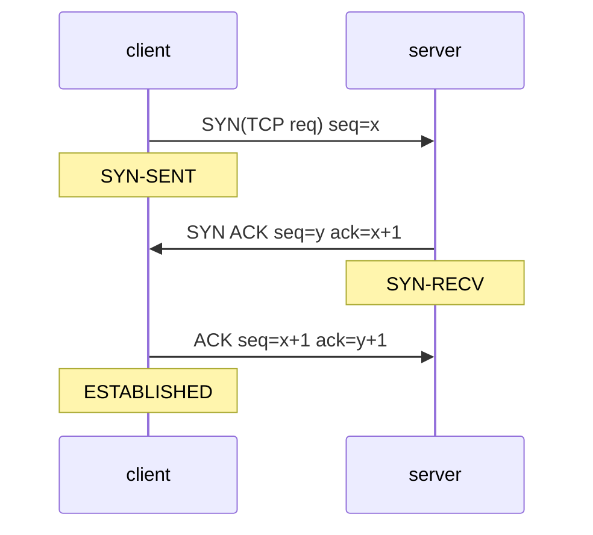
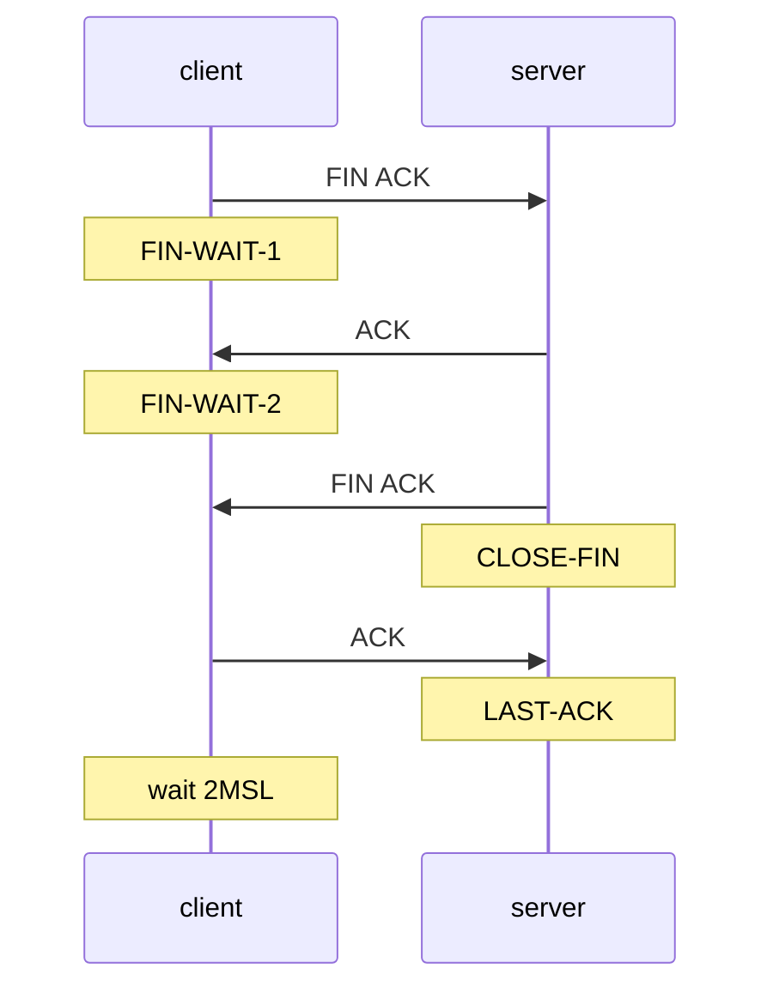

# Quick-Know TCP

- 全双工
- 点对点连接

> `MSS`(Maximum Segment Size) MSS=MTU-TCP_Header-IP_Header TCP payload
> 
> `MTU`(Maximum Transmission Unit) 最大链路层帧长度 data-link payload
> 
> TCP Segment=message+TCP header

## 连接

### 建立

> 三路握手

### 拆除

> 四路挥手

## 流量控制

> 维护接收窗口 消除发送方使**接收方缓存溢出**的可能性

:::tip TCP ZeroWindow Probe

当接收方缓存满时 回复 `Window Full` ACK 之后发送方会间断发送 Len为0的 `Keep-Alive` 接收方会回复 `ZeroWindow`
:::

## 拥塞控制

> 维护拥塞窗口(发送窗口) 防止网络拥塞

网络拥塞信号
- 超时
- 3个冗余ACK

~~为什么不是两个冗余ACK? 两个大概率是乱序 三个更可能是丢包~~

## 编程

服务端代码
@[code](../cpp/tcp/server.c)

客户端代码
@[code](../cpp/tcp/client.c)

Makefile
@[code](../cpp/tcp/Makefile)