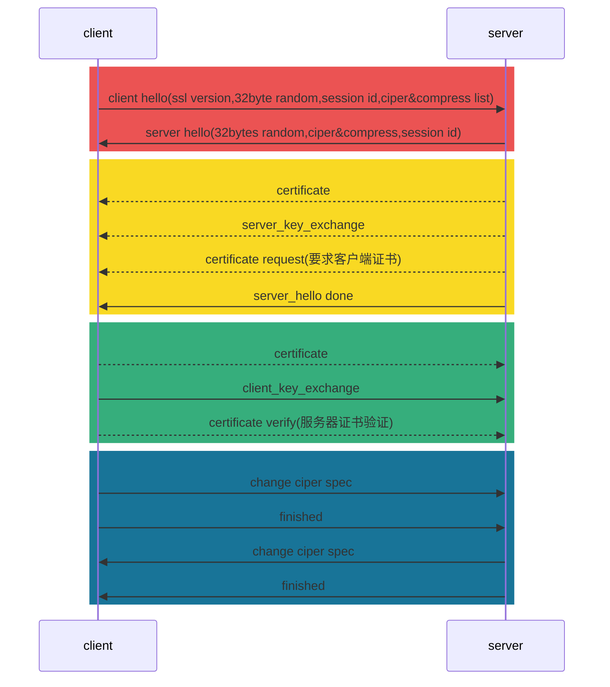

# Quick-Know SSL/TLS

:::details TLS 与 SSL 的关系与区别
SSL 是 Netscape 公司的产品 目前版本为3.0

TLS1.0 是 IETF制定的协议 建立在SSL3.0的基础上 有RFC文档 可以理解为标准化后的SSL(v3.1)

> TLS 与 SSL 所支持的加密算法不同 **不能互操作**

SSL/TLS 协议两层
| 协议 | 层级 | 作用 |
| :---: | ---- | --- |
| 记录协议(Record Protocol) | 较下层 位于可靠传输协议之上 | 提供数据封装 压缩 加密等基本功能 |
| 握手协议(Handshake Protocol) | 在**记录协议**上层 | 用于在数据传输开始前 双方**身份认证** **协商加密** **交换密钥** |

> SSL 的问题 只能提供双方认证 不能协调多方认证
:::

[][1]

TLS 是 SSL3.0的后续版本

## SSL

Secure Socket Layer(v3.0 until 1996)

三大特性
- 保密: 握手协议中定义话密钥后 所有消息加密
- 鉴别: 可选的客户端认证 + 强制的服务器端认证
- 完整性: 消息完整性检查

### 握手协议

完成 密钥协商交换、身份认证等

| 字段 | Type | Length | Content |
| --- | ---- | ------ | ------- |
| 字段长度(bytes) | 1 | 3 | x |
| 含义 | 类型 | 消息长度长度字节数 | 消息参数 |

#### 握手阶段

> 实线为必要内容 虚线为可选信息(依据实际的加密方法)

[][3]

更详细的流程图 : <https://img-blog.csdnimg.cn/20200520105721768.png>

第一阶段: 建立安全能力

服务端选取客户端支持的
- **版本** 两端能接受的最高版本
- **加密算法**
- **压缩办法**

第二阶段: 服务器验证和密钥交换

服务器发送
- (证书)
- (公钥) 根据密钥交换算法
- (请求客户证书)
- 密钥交换消息***key_exchange***

第三阶段: 客户端认证和密钥交换

客户端发送
1. (客户端证书)
2. 密钥交换消息***key_exchange***
3. (**客户端证明自己为证书持有者**)

第四阶段: 完成

客户端
1. 改变密码规格信息(后续消息通过协商的密钥进行加密)
2. 握手完成信息

服务器
1. 改变密码规格信息
2. 握手完成信息

### 记录协议

负责消息的压缩 加密和数据的认证

## TLS

Transport Layer Security(since 1999 [RFC 2246][2])

TLS 握手协议的子协议
1. 握手协议: 负责在客户端和服务器之间协商决定密码算法和共享密钥 包括基于证书的认证操作
2. 密码规格变更协议: 负责向通信对象传达变更密码方式的信号 在TLS 1.3版本中不再需要该协议
3. 警告协议: 负责在发生错误时将错误传达给对方
4. 应用数据协议: 将TLS 上面承载的应用数据传达给通信对象的协议

### [TLS1.2](https://tls12.ulfheim.net/)

> 跟前面SSL一样 需要2-RTT

:::tip 快速恢复
早期会话快速恢复 基于 会话id

问题
1. 分布式服务器中 不会同步session id
2. session id 的失效时间不好控制

> 引入 session ticket(用服务器密钥加密过的会话信息) 在完成握手后生成并发给客户端
> 
> 客户端通过在ClientHello报文携带session ticket来进行快速恢复

:::

### [TLS1.3](https://tls13.ulfheim.net/)

1. 废弃了RSA密钥交换方案 仅支持(EC)DHE密钥协商方案
2. 取消了密码规格变更协议

## 参考

- [SSL与TLS的区别以及介绍](https://kb.cnblogs.com/page/197396/)
- [SSL协议介绍](https://zhuanlan.zhihu.com/p/114612812)
- [TLS详解](https://www.jianshu.com/p/1fc7130eb2c2)
- [一篇文章让你彻底弄懂SSL/TLS协议](https://zhuanlan.zhihu.com/p/133375078)
- [ssl握手协议四个阶段](https://www.fisec.cn/1209.html)
- [Web技术（四）：TLS 握手过程与性能优化(TLS 1.2与TLS 1.3对比)](https://blog.csdn.net/m0_37621078/article/details/106126033#t4)

[1]: https://www.vircom.com/blog/how-to-use-ssltls-to-secure-your-communications-the-basics/
[2]: https://datatracker.ietf.org/doc/html/rfc2246
[3]: https://wanchuan.top/7736356289614c6ead0aca9380012501